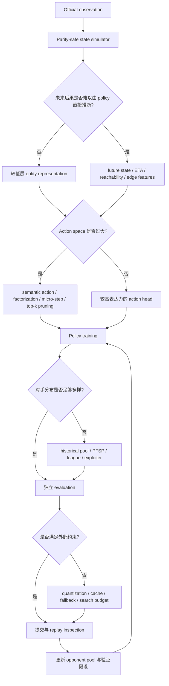

# Orbit Wars：第一性原理与 Solution Space

本文是 [[solutions]] 的二阶综合：先把八个方案放进统一坐标（Normalized Comparison），再区分 Convergence / Alternative Routes / Negative Evidence / Open Questions，然后做 Mechanism Synthesis 与 Decision Guide，最后才提炼 Top Principles 与 Transfer。训练专题的深入矩阵见 [[ppo-training]]，表示专题见 [[representation-design]]。

## 1. 第一性原理问题模型

Orbit Wars 表面上是选择 `[from_planet_id, angle, num_ships]`，本质上是一个带有延迟后果的资源分配和多智能体控制问题：

1. 当前 planet 的舰船是有限资源；发射立即消耗资源，结果经过 ETA 才出现。
2. 目标会移动，路线可能被太阳或其他 planet 阻挡；到达时的 ownership、garrison、incoming fleets 和 production 决定 action 是否值得。
3. 一回合可以有多个发射，组合 action space 爆炸。
4. 2P 接近零和；4P 存在非零和、联盟、策略循环和 stalling。
5. 训练和提交有不同的 compute bottleneck：训练要吞吐，提交要低延迟和 parity。

因此真正的 optimization target 不是"预测一个动作"，而是：在有限计算和不完全显式的未来信息下，选择一个能改善长期终局资源优势的可执行行动。

## 2. Normalized Comparison

具体配置矩阵在 [[solutions]]（方案级）与 [[ppo-training]] / [[representation-design]]（专题级）；本节给出归一化后的机制坐标——八个方案实际分布在五个功能层上：

| 层 | 谁交给规则/模拟系统 | 谁交给神经网络 |
|---|---|---|
| Simulator | 前八名公开方案均使用 JAX/Rust/C++ 等加速或重实现环境作为正式训练底座，并强调 parity / consistency | — |
| 未来信息 | Felix（reachability tensor）、Jake（combat preview）、flg（23 到达桶）、Hober（T=19 序列）、Ender（24 桶投影）、Audun（辅助预测头） | Isaiah（靠容量自己学） |
| 几何可行性 | Felix（tensor 内解析）、Jake（intent 解析）、Audun（planner + mask）、Isaiah（Rust 侧解角）、Ender（可达目标计算） | — |
| 动作接口 | 各家不同（见下） | policy 在接口内选择 |
| 训练分布 | PFSP/league/pool（六家） | — |

方案差异的本质不是"用什么网络"，而是**把哪一层交给规则系统、哪一层交给神经网络**：

- 动作接口谱系：no-op/all-in（Hober）→ 发射桶（TonyK、Audun、Ender 的比例档）→ semantic intent（Felix、Jake）→ 连续 mixture（Isaiah）→ micro-step 序列（Ender）。
- 信息接口谱系：完全 raw entity（Isaiah）→ body 时间序列（Hober）→ 到达桶/日历（flg、Ender、TonyK）→ 全量 reachability tensor（Felix）→ combat preview + resolved cost（Jake）。
- 资源谱系不是单轴：Isaiah 主要投入 model capacity + experience；Felix/Jake/flg/Audun/Ender 更多投入 explicit structure；TonyK 额外利用 demonstrations/BC 购买 basic competence。三类资源可以部分替代，但受 inference、engineering 与 data budget 约束。

## 3. Cross-solution Convergence

多个**独立**方案的收敛（这是高置信原则的主要来源）：

1. **高吞吐且 parity-safe 的 simulator 是强工程收敛**：多个前列方案明确依赖 JAX / Rust / C++ 等加速或重实现路径，以支持大规模 self-play、league、tournament、planner 或 forward simulation。公开材料整体显示吞吐是重要 enabling infrastructure，但不能据此推出“官方 Python 环境绝对无法成功”或“每个强方案都必须重写环境”的反事实结论。
2. **未来后果被显式结构化是主流路线，但不是必要条件**：Hober/Felix/Jake/TonyK/flg/Ender 把 future/arrival/consequence 信息直接送入 policy，Audun 通过 multi-horizon auxiliary targets 强化 future representation；Isaiah 则用 200M/15B 的 low-level route 证明 capacity + experience 可以替代一部分显式结构。
3. **可行性解析与战略选择分层**：Felix、Jake、Audun、Isaiah、Ender 五家把角度/ETA/可达性交给解析系统，policy 只选意图或候选。
4. **最终 strategic objective 高度收敛于 terminal outcome**：TonyK 等直接使用稀疏终局目标；Audun 的部分 shaping 实验失败，但 flg 证明 dense reward 可以作为 temporary scaffold，再通过 teacher transfer 迁移到最终策略。
5. **历史对手进入训练分布**：Felix、Jake、TonyK、flg、Audun、Ender 六个主要系统使用 historical pool / PFSP / league；Isaiah 赛后明确表示若重做会给 4P 加 league，SimJeg 则曾实验 frozen checkpoints、但在 final run 中移除。
6. **相对化/旋转不变表示**：Jake（旋转不变特征）、flg（纯相对输入）、Audun（按座位旋转）、Ender（p0 归一）、Felix（p0 视角）——五家独立到达同一机制以消除座位依赖偏差。

## 4. Alternative Routes

少数方案证明可行、但**不能**推广为共识的条件路线：

- **BC warm start**（TonyK）：random exploration 冷启动成本极高且有高质量 replay 时，先解决 basic competence 再交给 RL。边界证据：SimJeg 的 IL 初始化最终被 from scratch 反超——吞吐足够时冷启动优势被摊薄。
- **Bitter-lesson 规模化**（Isaiah）：200M + 15B steps + 2400 B200-hours 在低层表示上成功；但 Ender 用 4 层 d192 + $170 同样进前 8。规模是充分条件之一，不是必要条件——且受提交文件/延迟上限约束（Isaiah 也停在 200M）。
- **IMPALA/V-trace 异步**（TonyK）：TonyK 选择 off-policy actor-learner + V-trace；多数其他方案使用 PPO，flg 也采用 async rollout/PPO。它更像 data-collection/learner architecture 的条件路线，而不是排行榜共同机制。
- **小模型 dense-reward 迁移**（flg）：先用便宜模型 + shaped reward 建立"赢"的概念，再 teacher KL 迁移。独此一家，且与"dense shaping 被否决"的收敛形成有界对比——shaping 用于临时脚手架而非最终目标。
- **Micro-step 序列决策**（Ender）：唯一保留一回合多次发射的表达力；其余方案都放弃了这一自由度（Hober 的 fraction 档无人使用也侧面支持该自由度价值有限，但 Ender 实际用到了多次发射且有效——两份证据方向相反，保持 open）。

## 5. Negative Evidence

失败方向与被否决的直觉（详见 [[solutions]] 各节与 [[ppo-training]]）：

- **Audun 的受控否决表**（每改动 100M steps + ~512 局 round-robin）：dominance reward shaping 34.6%、对 live copy 训练 20.7%、8-model league 17.6%、double batch size 41.4%、更短 rollout 33.4%、连续 fraction head 50.2%。排除"shaping 应该有用""league 一定更好""batch 越大越稳"等心智模型。
- **Isaiah：action mask 让模型变差**（作者推测：被迫自己建模物理反而有益——解释而非已证明因果）；gamma=1.0 导致先领先再 stalling，浪费已定局面的 rollout。
- **Ender：gamma=1.0 双向躺平**（领先方与落后方都停止行动）；负 reward + gamma<1 鼓励拖延失败。共同解释了各家非对称 reward 设计。
- **flg：<100% 发射档完全无收益**（大量工程投入后）；4P league 池过窄，遇弱反而差；4P 本地搜索增益不能迁移到 leaderboard。
- **SimJeg：fraction bucket 在 IL 阶段已被放弃**；多个 stabilization trick 未做 ablation、自述"很可能没用"。
- **Audun 2P 过拟合事故**：只打 ≤1M steps 旧自身副本 + 末期低熵低 LR 微调 + 评估只对自己模型 → 对 top 10 几乎全败。训练与评估回路中没有任何信号能暴露过拟合。
- **Felix：至少三倍于展示的 run 平台化或崩溃**；4P 一个 bug 截止前 36 小时才发现。

## 6. Open Questions

1. 相同 compute budget 下，模型 scaling（Isaiah）与 explicit future representation（其余）谁更有效？无同预算对比。
2. Semantic action 的收益来自更好的 inductive bias 还是更低的 action entropy？
3. 4P 最佳 opponent curriculum 是 historical pool、PFSP、league 还是 exploiter？（各家都有效但无横向比较）
4. Search 的收益是长期规划还是避免少量短视错误？（flg 2P +30–40 分 vs 4P 不可迁移）
5. Learned world model 能否替代 hand-written forward simulator？
6. Replay 数量/质量/playstyle diversity 如何量化影响 BC → RL？
7. Ender 的多次发射表达力 vs 多家 fraction 档无人使用——一回合多发射的真实价值边界在哪？
8. 缺少跨作者、同硬件、同 opponent pool 的复现实验；排名不能证明组件因果。

## 7. Mechanism Synthesis

跨方案之后，真正被改变的机制变量（Problem → Intervention → Changed mechanism → Expected consequence）：

**M1 信息接口（policy 需要自己模拟未来吗？）**
```text
delayed consequence 下的 value 判断难以从 raw state 学习
→ future-state / reachability / combat preview / 到达桶
→ 未来结果从"必须学习的目标"变成"可以直接比较的输入"
→ 学习负担从长期物理预测转移到战略选择
```
证据：七家收敛 + Isaiah 的容量替代路线成功（两种解都可行）。边界：预测 horizon 不足（Hober T=20 之外的 fleet 不可见）或 forecast error 累积时接口反而误导。

**M2 探索接口（action space 的搜索难度）**
```text
组合 action space 让探索与 credit assignment 被无效动作淹没，几何可行性解算拖累训练
→ no-op/all-in / semantic intent / factorization / bucket / micro-step / 可行性解析（tensor、planner、intent 解算、mask）
→ 决策从"枚举连续参数"变为"在有意义且可执行的选项间选择"
→ 探索集中在高价值行为附近
```
证据：Felix 从固定比例换 semantic intent 后学习速度大增；Hober 极简动作 + 4.3M 模型到 top 5；Ender micro-step 分解 9,460→43 候选；五家可行性解析（Felix tensor、Jake intent、Audun planner、Isaiah 角度、Ender 候选）。动作分解与可行性解析改变的是同一机制变量（动作空间的搜索难度），合并计数。边界：abstraction 漏掉高价值行为时形成硬 ceiling（flg fraction 档无人用是反方向证据：多给的自由度也可能无价值）。

**M3 训练分布（对手从哪来）**
```text
self-play 只学会击败当前/近期自身的风格
→ historical pool / PFSP / league
→ 训练分布覆盖更宽的策略空间
→ playstyle overfit 与 strategic cycling 下降
```
证据：六个主要系统采用 historical opponent 机制；Jake 4P PFSP ~300M steps 带来显著提升，Audun 4P 崩溃后加入全历史池作为 single change 扭转训练，且其 live-copy 对照只有 20.7%。Isaiah 的 postmortem 进一步支持 4P league 的必要性边界。边界：池可能过窄（flg）、预算不足时 league 动力学失败（Audun 8-model 17.6%）。

**M4 样本效率结构（每份 rollout 的信息量）**
```text
已定局面/无效帧消耗 rollout 预算
→ surrender / early reset / 提前终止 / earlygame 专用 envs
→ 同预算下"局面未定"的状态密度上升
→ sample efficiency 提高
```
证据：五家五种实现，Jake 量化 60–70%。边界：依赖判定准确性（Jake 保留 5% holdout 校准）。

**M5 归因基础设施（怎么知道在进步）**
```text
训练噪声、对手偏差、工程回归伪装成改进
→ 固定预算实验 + round-robin + 独立 tournament + replay inspection
→ 改动效果可归因、过拟合可见
→ 迭代速度与置信度同时提高
```
证据：Audun 的 200-experiment 流程是正面样板（且直接产出最系统的 negative evidence）；其 2P 事故是缺失该设施的反而教材。

## 8. Decision Guide



先修 simulator/parity，再判断信息接口和动作表示，最后才是模型规模、训练方式与 search。不能从"某方案用 Transformer"倒推 Transformer 是主要机制。

最后一列只列公开证据支持的最便宜诊断/证伪方式；没有可信廉价检验的保持未知，不虚构。

| 观察到的问题 | 候选干预 | 机制依据 | 边界/风险 | 最便宜的诊断/证伪 |
|---|---|---|---|---|
| simulator 太慢或与官方不一致 | JAX/Rust/C++ rewrite + parity tests | M1 的前提 | silent mismatch | 对官方引擎逐局 replay parity 测试（多家采用） |
| policy 不会判断延迟结果 | future ownership/garrison、arrival timeline、capture cost | M1 | horizon 不足或预测过贵 | 固定预算下接口有/无成对 ablation + round-robin 判定 |
| raw action space 过大 | semantic action、target factorization、micro-step | M2 | 漏掉高价值动作形成 ceiling | 对 oracle/强 replay 测高价值行为候选覆盖 |
| planner 候选过多 | top-k + random、action mask | M2 | model bias 永久漏掉正确目标 | 对暴力 oracle 测 recall + 随机候选消融（Audun：recall 93–95%，去随机后 45.7%） |
| 有高质量 replay、冷启动慢 | BC → RL | M2/M3 的条件路线 | 专家分布偏窄；吞吐足够时优势被摊薄 | 短预算 from-scratch 对照（SimJeg 最终反超 IL） |
| 2P 可用、4P 崩溃 | historical pool、PFSP、league | M3 | 池覆盖不足；低预算下 league 动力学失败 | 单变量替换对手分布的固定预算实验（Audun "single change" 扭转） |
| 本地胜率高、leaderboard 低 | 独立 opponents、seed/timing audit、replay inspection | M5 | validation mismatch | held-out tournament 对外部/更强对手（Audun 2P 事故的暴露方式） |
| episode 远长于胜负决定点 | surrender / early reset / 截断 | M4 | 判定不准引入偏差 | 保留小比例全程局校准判定阈值（Jake 5% holdout） |
| 模型过大、推理超时 | quantization、fallback、search budget | 提交层 | 量化损失 | 在目标硬件上测延迟/overage 分布（Isaiah：8% 4P 慢局切 fallback） |

## 9. Top Principles

由 M1–M5 候选机制合并等价项后按 Impact / Evidence Breadth / Mechanistic Clarity / Transferability / Distinctness 排序。机制分离说明：M1（信息）与 M2（动作/探索，含可行性解析）是不同机制变量，分别独立成原则；M4、M5 证据宽度略窄于前三者，入 Secondary Findings：

### 1. Expose cheap, exact, reusable environment structure at the policy interface

- **Problem Signature**：动作后果延迟兑现（ETA 后的 ownership、生产与战斗变化），且这些未来量可由环境可靠计算。
- **Principle**：当 future-state、ETA、reachability、combat preview 等结构可以廉价、精确、可复用地计算时，优先显式暴露给 policy；当这些结构昂贵、不可靠，或 capacity/data 足够充足时，scaling 是有证据支持的替代路线。
- **Mechanism**（M1，信息接口）：显式结构把一部分确定性环境推理从 model learning 转成可比较的输入或辅助监督，降低 sample/representation burden；Isaiah 的 200M/15B low-level route 则定义了这条原则的 strongest counterexample 与 compute boundary。
- **Use When**：动作后果延迟兑现，且未来量可可靠计算（几何、资源、时序）。
- **Boundary**：horizon 之外的后果系统性不可见；forecast 误差累积会误导；需要 simulator parity。可行性解析（recall / mask）属动作/探索机制家族，见原则 2。

### 2. Action representation controls exploration

- **Problem Signature**：组合 action space 让探索与 credit assignment 被无效动作淹没；角度/ETA/可达性的几何成本拖累训练。
- **Principle**：动作分解（no-op/all-in、semantic intent、factorization、bucket、micro-step）与可行性解析（tensor / planner / intent 解算 / mask）都在重新分配搜索难度；选择标准是高价值行为覆盖，不是接口优雅。
- **Mechanism**（M2，动作/探索）：决策从"枚举连续参数"变为"在有意义且可执行的选项间选择"，探索集中在高价值行为附近。动作分解与可行性解析改变同一机制变量，合并在本原则下计数：证据为 Felix semantic switch 提速、Hober 极简动作进 top 5、Ender 43 候选分解、五家可行性解析（Felix tensor、Jake intent、Audun planner、Isaiah 角度、Ender 候选）；对照：flg fraction 档无收益。
- **Use When**：raw action 高维组合、回报延迟稀疏、或一回合含多次相关动作。
- **Boundary**：abstraction 遗漏高价值策略即成 ceiling；可行性层 recall 是策略上限（Audun planner 93–95%）；合法性判断全部移出模型可能剥夺有用学习信号（Isaiah mask 负结果）。覆盖论证（coverage/recall/held-out evaluation）必须先行。

### 3. Opponent distribution is part of the training algorithm

- **Problem Signature**：self-play/多智能体环境中对手分布随训练移动，"只击败当前对手"不等于学到可泛化策略。
- **Principle**：历史 checkpoint、PFSP、league 改变的是训练分布本身，与 loss 同级；teacher KL 属 policy drift / competence transfer，不应并入 opponent distribution。
- **Mechanism**：训练分布覆盖更宽的策略空间，降低 playstyle overfit 与 strategic cycling（M3）。证据：M3 六个主要系统采用 + live-copy 20.7% 的受控否决 + Jake/Audun 两个强扭转案例；Isaiah 的 4P postmortem 提供额外边界支持。
- **Use When**：self-play/对抗/多智能体环境非平稳，或本地胜率与线上不一致。
- **Boundary**：池可能过窄、增加 rollout 与评估成本、低预算下 league 动力学失败；必须与独立 tournament 配合使用。

### Secondary Findings（未进 Top 3 但保留）

- **有效状态密度**（M4）：五家五种实现的收敛，量化收益明确（60–70%），证据宽度略窄于前三者。
- **评估即归因基础设施**（M5）：Audun 正反两面的完整案例；训练回路"看不见"的过拟合只有评估协议能暴露。
- **规模是充分条件而非必要条件**：Isaiah vs Ender 的对照定义了资源谱系两端。

## 10. Transfer

不逐条复述上面的原则，而是给出迁移时的识别与验证入口：问题签名（在未来项目中如何认出它）、假设、失败方式、替代实现与第一步验证。

### Feasibility layer before policy layer

问题签名：raw action space 带几何、资源或安全约束，后果延迟兑现。假设：存在足够正确且快速的 simulator，候选生成器不漏高价值动作。可能失败：physics mismatch、剪枝过强、长 horizon 预测失真。替代实现：analytic planner、lookup table、learned feasibility model、constraint solver。第一步验证：对暴力枚举测候选生成器的 recall。类似任务：机器人规划、调度、组合游戏、受约束生成。

### Semantic action over raw parameters

问题签名：raw continuous action 难探索、高价值行为稀疏。假设：领域存在稳定可解析的 intent。可能失败：intent 集合遗漏策略形成 ceiling。替代实现：factorization、bounded bucket、micro-step、no-op/all-in。第一步验证：对强 replay 或专家行为测 intent 集合的行为覆盖。类似任务：robotics skills、resource allocation、program synthesis。

### Future-state interface

问题签名：observation 无法直接表达 delayed consequence，但未来量可计算。假设：预测 horizon 足够有用且误差可控。可能失败：环境非平稳、误差累积、计算过贵。替代实现：输入特征（到达桶/日历）、辅助预测头、时间序列展开。第一步验证：固定预算下接口有/无的成对 ablation。类似任务：long-horizon control、供应链、金融模拟、多智能体规划。

### Opponent distribution as an algorithmic component

问题签名：对抗日益单一、本地胜率上升但外部表现不升。假设：池覆盖未来真实威胁。可能失败：池过窄、采样偏置、league dynamics 不稳定。替代实现：PFSP、历史池、手工 league、exploiter。第一步验证：单变量替换对手分布的固定预算对照。类似任务：adversarial training、red-team、multi-agent RL、RLHF 中的 reward model 对抗。

### Evaluation as causal infrastructure

问题签名：改动效果说不清，训练噪声、对手偏差与工程回归伪装成改进。假设：评估对手与 metric 代表真实目标。可能失败：validation mismatch、leaderboard shift、过度优化本地 tournament。替代实现：round-robin tournament、held-out 外部对手、replay inspection。第一步验证：先建最小固定预算 + 多对手判定流程，再谈改动。类似任务：offline RL、benchmark engineering、生产 ML 迭代。

## Evidence Map

- E1 — Isaiah Pressman solution — official writeup + public repository
- E2 — SimJeg / Hober Malloc solution — official writeup + public repository
- E3 — Felix Neumann solution — official writeup
- E4 — Jake Will solution — official writeup
- E5 — TonyK solution — official writeup + public repository
- E6 — flg solution — official writeup + public repository
- E7 — Audun Ljone Henriksen solution — official writeup
- E8 — Ender / Billy Bradley solution — official writeup + public repository
